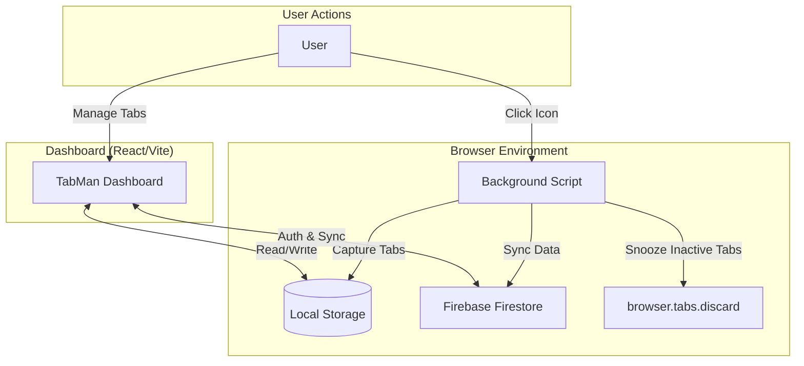

<div align="center">


# Lorapok TabMan

**Collapse the chaos. Save your memory.**

[](https://github.com/Maijied/Lorapok-TabMan/actions)
[](https://maijied.github.io/Lorapok-TabMan/)
[](https://www.typescriptlang.org/)
[](https://react.dev/)
[](https://firebase.google.com/)
[](LICENSE)

[🌐 Live Dashboard](https://maijied.github.io/Lorapok-TabMan/) · [📦 Download Extension](https://github.com/Maijied/Lorapok-TabMan/releases/latest) · [@LorapokLabs](https://x.com/LorapokLabs)

</div>

---

## Overview

**Lorapok TabMan** is a next-generation Firefox tab manager built for power users. One click collapses all your open tabs into a structured, searchable dashboard — reducing browser memory usage by up to **95%**.

Sign in with Google to sync your tab groups across all devices, or use it offline with local storage.

---

## 🏗️ Architecture Overview



### Core Components
- **Background Engine**: Persistent MV2 script that handles tab capture via `browser.browserAction` and runs the Tab Snooze inactivity tracker using `browser.alarms`.
- **React Dashboard**: High-speed interface built with React 19 and Vite for lightning-fast state management.
- **Firebase Integration**: Secure sync via Firestore + Firebase Auth. Config sourced from `VITE_*` environment variables — never hardcoded.

---

## ✨ Key Features

- **⚡ One-Click Collapse** — Save all open tabs and close them instantly, reclaiming up to 95% of tab memory
- **😴 Tab Snooze** — Automatically unloads inactive tabs from memory after a configurable timeout (1 min – 7 days). Snoozed tabs show a blurred overlay with the TabMan logo in the Dashboard.
- **☁️ Cloud Sync** — Sign in with Google to sync tab groups across all devices via Firebase
- **📁 Smart Groups** — Organize tabs into named groups with stars, locks, and hierarchical tags
- **⌨️ Keyboard Shortcuts** — Navigate and manage at lightning speed (`G`, `A`, `R`, `S`, `?`)
- **📊 Memory Analytics** — Visualize how much RAM you've reclaimed with charts
- **📦 Bulk Operations** — Multi-select tagging, archiving, and deletion
- **🔄 OneTab Migration** — Import your existing OneTab sessions instantly

---

## 🛠️ Technical Stack

| Layer | Technology |
|---|---|
| Frontend | React 19, Tailwind CSS, Framer Motion, Lucide Icons |
| Bundler | Vite |
| Database | Google Firebase (Firestore) |
| Authentication | Firebase Auth (Google + Email/Password) |
| Extension API | WebExtensions API (Manifest V2) |
| CI/CD | GitHub Actions |
| Hosting | GitHub Pages |

---

## 📂 Project Structure

```bash
├── .github/
│   └── workflows/
│       └── deploy.yml             # Unified CI/CD: version bump → ZIP → AMO → Pages deploy
├── public/
│   ├── extension/
│   │   ├── manifest.json          # Extension Manifest (Firefox MV2)
│   │   ├── background.js          # Tab capture + Tab Snooze logic
│   │   └── icons/                 # Brand assets (6 sizes: 16–128px)
│   └── logo.png                   # Lorapok TabMan badge logo
├── src/
│   ├── pages/                     # App Pages (Landing, Dashboard)
│   ├── components/                # Reusable UI Components
│   ├── lib/                       # Utilities (Firebase, Storage)
│   └── types.ts                   # Type Definitions
├── firestore.rules                # Firebase Security Rules
├── .env.example                   # Environment variable template
└── package.json
```

---

## 🚀 Getting Started

### Environment Setup

```bash
cp .env.example .env
```

Fill in your Firebase values from [Firebase Console](https://console.firebase.google.com/) → Project Settings → Your apps → Web app:

```env
VITE_FIREBASE_API_KEY="your-api-key"
VITE_FIREBASE_AUTH_DOMAIN="your-project.firebaseapp.com"
VITE_FIREBASE_PROJECT_ID="your-project-id"
VITE_FIREBASE_APP_ID="1:123456789:web:abcdef"
VITE_FIREBASE_MESSAGING_SENDER_ID="123456789"
VITE_FIREBASE_STORAGE_BUCKET="your-project.appspot.com"
VITE_FIREBASE_DATABASE_ID="(default)"
```

### Local Development

```bash
npm install
npm run dev        # Dashboard at http://localhost:5173
```

### Load Extension in Firefox

1. Open Firefox → `about:debugging` → **This Firefox**
2. Click **Load Temporary Add-on...**
3. Select `public/extension/manifest.json`

---

## 🚢 Deployment

### GitHub Actions Secrets

Configure in **Settings → Secrets and variables → Actions**:

| Secret | Used In | Description |
|---|---|---|
| `FIREBASE_API_KEY` | `deploy.yml` | Firebase Web API key |
| `FIREBASE_AUTH_DOMAIN` | `deploy.yml` | Firebase auth domain |
| `FIREBASE_PROJECT_ID` | `deploy.yml` | Firebase project ID |
| `FIREBASE_APP_ID` | `deploy.yml` | Firebase app ID |
| `FIREBASE_MESSAGING_SENDER_ID` | `deploy.yml` | Firebase messaging sender ID |
| `FIREBASE_STORAGE_BUCKET` | `deploy.yml` | Firebase storage bucket |
| `FIREBASE_DATABASE_ID` | `deploy.yml` | Firestore database ID |
| `AMO_API_KEY` | `deploy.yml` | Mozilla AMO JWT issuer |
| `AMO_API_SECRET` | `deploy.yml` | Mozilla AMO JWT secret |

### First Deploy Guide

1. Configure all 9 secrets above
2. Deploy Firestore rules: `firebase deploy --only firestore:rules`
3. Update `DASHBOARD_URL` in `public/extension/background.js`
4. Push to `main` — CI/CD handles everything automatically

---

## 🤝 Contribution

1. Fork the Project
2. Create your Feature Branch (`git checkout -b feature/AmazingFeature`)
3. Commit your Changes (`git commit -m 'Add some AmazingFeature'`)
4. Push to the Branch (`git push origin feature/AmazingFeature`)
5. Open a Pull Request

---

## 📄 License

Distributed under the **Apache-2.0 License**.

Developed and maintained by **Mohammad Maizied Hasan Majumder** for **Lorapok Labs** · Bangladesh.

---

<div align="center">
<em>Stay Focused. Stay Light. Built by Lorapok Labs.</em>
</div>
