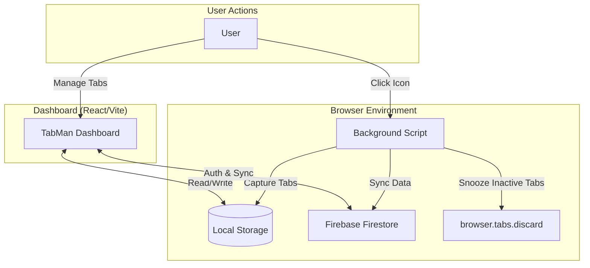

# 🛡️ Lorapok TabMan

[](https://github.com/lorapok)
[](https://addons.mozilla.org/firefox/)
[](LICENSE)

**Lorapok TabMan** is a next-generation, high-performance browser extension for Firefox designed to eliminate tab clutter and reclaim system resources. By collapsing your active browsing session into a structured, searchable dashboard, TabMan reduces memory footprint by up to **95%**.

---

## 🏗️ Architecture Overview

Lorapok TabMan follows a decoupled architecture, separating the tab capture logic from the management interface.



### Core Components
- **Background Engine**: A persistent script that monitors tab state, handles the atomic "Collapse" operation via the WebExtensions API, and runs the Tab Snooze inactivity tracker.
- **React Dashboard**: A high-speed interface built with React 19 and Vite for lightning-fast state management and rendering.
- **Firebase Integration**: Secure synchronization layer using Firestore and Firebase Authentication (Google Login). Configuration is sourced from environment variables — see [Environment Setup](#-environment-setup).

---

## ✨ Key Features

- **⚡ One-Click Collapse**: Reclaim your RAM instantly. TabMan saves all open tabs and closes them in a single sweep.
- **😴 Tab Snooze System**: Automatically unloads inactive browser tabs from memory after a configurable inactivity period (1 minute to 7 days). Snoozed tabs reload instantly when you click them. Configure the timeout in Dashboard → Settings → Tab Snooze. Snoozed tabs appear with a blurred overlay and the TabMan logo in the Dashboard.
- **🔄 Hybrid Data Model**:
  - **Local Mode**: Works offline with zero configuration using browser local storage.
  - **Global Sync**: Authenticate with Google to sync your tab groups across all your devices.
- **📁 Smart Grouping**: Organize tabs into named groups. Star important sessions, lock records, and add hierarchical tags to either entire groups or specific tabs.
- **⌨️ Power User Shortcuts**: Navigate the dashboard at lightning speed with a full set of keyboard shortcuts.
- **📊 Resource Analytics**: Visualize how much memory you've reclaimed on your system with built-in analytics.
- **📦 Bulk Operations**: Manage dozens of groups at once with multi-select tagging and archiving.
- **🎨 Dark Mode UI**: A signature Lorapok Labs aesthetic — Navy and Sky Blue palette with Framer Motion animations.
- **📜 Auto-Archive Engine**: Configurable settings to automatically keep your workspace clean by moving old sessions.

---

## 🛠️ Technical Stack

- **Frontend**: React 19, Tailwind CSS, Framer Motion, Lucide Icons.
- **Bundler**: Vite.
- **Database**: Google Firebase (Firestore).
- **Authentication**: Firebase Auth (Google Provider + Email/Password).
- **Extension API**: WebExtensions API (Manifest V3).

---

## 📂 Project Structure

```bash
├── .github/
│   └── workflows/
│       ├── deploy.yml             # Dashboard → GitHub Pages CI/CD
│       └── publish-firefox.yml   # Extension → Mozilla AMO CI/CD
├── public/
│   ├── extension/
│   │   ├── manifest.json          # Extension Manifest (Firefox MV3)
│   │   ├── background.js          # Tab capture + Tab Snooze logic
│   │   └── icons/                 # Brand assets (6 sizes)
│   └── logo.png                   # Lorapok TabMan badge logo
├── src/
│   ├── pages/                     # App Pages (Landing, Dashboard)
│   ├── components/                # Reusable UI Components
│   ├── lib/                       # Utilities (Firebase, Storage)
│   └── types.ts                   # Type Definitions
├── firestore.rules                # Firebase Security Rules
├── .env.example                   # Environment variable template
└── package.json                   # Dependencies
```

---

## 🚀 Getting Started

### Prerequisites
- Firefox Browser (109.0 or later)
- Node.js 18+
- (Optional) A Google account for Cloud Sync

### Environment Setup

Copy `.env.example` to `.env` and fill in your Firebase values from the [Firebase Console](https://console.firebase.google.com/) → Project Settings → General → Your apps → Web app:

```bash
cp .env.example .env
```

```env
VITE_FIREBASE_API_KEY="your-api-key-here"
VITE_FIREBASE_AUTH_DOMAIN="your-project-id.firebaseapp.com"
VITE_FIREBASE_PROJECT_ID="your-project-id"
VITE_FIREBASE_APP_ID="1:123456789:web:abcdef"
VITE_FIREBASE_MESSAGING_SENDER_ID="123456789"
VITE_FIREBASE_STORAGE_BUCKET="your-project-id.appspot.com"
VITE_FIREBASE_DATABASE_ID="(default)"
```

### Installation (Local Development)

1. **Clone the Repository**:
   ```bash
   git clone https://github.com/lorapok/tabman.git
   cd tabman
   ```

2. **Install Dependencies**:
   ```bash
   npm install
   ```

3. **Start the Dashboard**:
   ```bash
   npm run dev
   ```

4. **Load the Extension into Firefox**:
   - Open Firefox and go to `about:debugging#/runtime/this-firefox`.
   - Click **Load Temporary Add-on...**.
   - Navigate to the project directory and select `public/extension/manifest.json`.

---

## 🚢 Deployment

### GitHub Actions Secrets

Before deploying, configure the following secrets in your repository:
**Settings → Secrets and variables → Actions → New repository secret**

| Secret Name | Used In | Description |
|---|---|---|
| `FIREBASE_API_KEY` | `deploy.yml` | Firebase Web API key |
| `FIREBASE_AUTH_DOMAIN` | `deploy.yml` | Firebase auth domain |
| `FIREBASE_PROJECT_ID` | `deploy.yml` | Firebase project ID |
| `FIREBASE_APP_ID` | `deploy.yml` | Firebase app ID |
| `FIREBASE_MESSAGING_SENDER_ID` | `deploy.yml` | Firebase messaging sender ID |
| `FIREBASE_STORAGE_BUCKET` | `deploy.yml` | Firebase storage bucket |
| `FIREBASE_DATABASE_ID` | `deploy.yml` | Firestore database ID |
| `AMO_API_KEY` | `publish-firefox.yml` | Mozilla AMO JWT issuer key |
| `AMO_API_SECRET` | `publish-firefox.yml` | Mozilla AMO JWT secret |

### CI/CD Pipelines

**Dashboard → GitHub Pages** (`deploy.yml`):
- Triggers on every push to `main`
- Builds the React app with Vite, injecting Firebase secrets as `VITE_*` env vars
- Deploys `dist/` to the `gh-pages` branch

**Extension → Mozilla AMO** (`publish-firefox.yml`):
- Triggers on push to `main` when files under `public/extension/**` change, or manually via `workflow_dispatch`
- Bumps the patch version in `manifest.json` automatically
- Packages `manifest.json`, `background.js`, and `icons/` into a ZIP
- Signs and submits to AMO using `web-ext sign` with `AMO_API_KEY` and `AMO_API_SECRET`
- Uploads the signed ZIP as a GitHub Actions artifact
- Commits the version bump back to `main`

### First Deploy Guide

1. **Configure all 9 GitHub Actions secrets** listed in the table above.

2. **Create your `.env` file** from `.env.example` and fill in Firebase values.

3. **Deploy Firestore security rules**:
   ```bash
   npm install -g firebase-tools
   firebase login
   firebase deploy --only firestore:rules
   ```

4. **Update `DASHBOARD_URL` in `public/extension/background.js`** — replace the placeholder with your actual GitHub Pages URL:
   ```javascript
   const DASHBOARD_URL = "https://yourusername.github.io/lorapok-tabman/dashboard";
   ```

5. **Push to `main`** — the `deploy.yml` workflow builds and deploys the dashboard to GitHub Pages automatically.

6. **Trigger the extension publish** — push any change to `public/extension/` or manually trigger `publish-firefox.yml` from the Actions tab.

7. **Verify AMO submission** — log in to [addons.mozilla.org/developers](https://addons.mozilla.org/developers/) and check the submission status.

---

## 🤝 Contribution

Contributions are what make the open source community such an amazing place to learn, inspire, and create. Any contributions you make are **greatly appreciated**.

1. Fork the Project
2. Create your Feature Branch (`git checkout -b feature/AmazingFeature`)
3. Commit your Changes (`git commit -m 'Add some AmazingFeature'`)
4. Push to the Branch (`git push origin feature/AmazingFeature`)
5. Open a Pull Request

---

## 📄 License & Attribution

Distributed under the **Apache-2.0 License**.

Developed and Maintained by **Mohammad Maizied Hasan Majumder** for **Lorapok Labs**.

---
*Stay Focused. Stay Light. Built by Lorapok Labs.*
