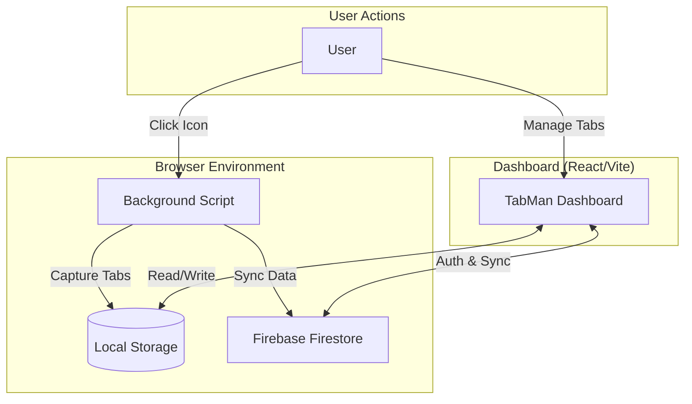

# 🛡️ Lorapok Tabman

[](https://github.com/lorapok)
[](https://addons.mozilla.org/firefox/)
[](LICENSE)

**Lorapok Tabman** is a next-generation, high-performance browser extension for Firefox designed to eliminate tab clutter and reclaim system resources. By collapsing your active browsing session into a structured, searchable dashboard, Tabman reduces memory footprint by up to **95%**.

---

## 🏗️ Architecture Overview

Lorapok Tabman follows a decoupled architecture, separating the tab capture logic from the management interface.



### Core Components
-   **Background Engine**: A persistent script that monitors tab state and handles the atomic "Collapse" operation via the WebExtensions API.
-   **React Dashboard**: A high-speed interface built with React 19 and Vite for lightning-fast state management and rendering.
-   **Firebase Integration**: Secure synchronization layer using Firestore and Firebase Authentication (Google Login).

---

## ✨ Key Features

-   **⚡ One-Click Collapse**: Reclaim your RAM instantly. Tabman saves all open tabs and closes them in a single sweep.
-   **🔄 Hybrid Data Model**: 
    -   **Local Mode**: Works offline with zero configuration using browser local storage.
    -   **Global Sync**: Authenticate with Google to sync your tab groups across all your devices.
-   **📁 Smart Grouping**: Organize tabs into named groups. Star important sessions, lock records to prevent accidental deletion, and add metadata.
-   **🔍 Global Search**: Advanced filtering system to find specific URLs or page titles across months of historical tab groups.
-   **🎨 Dark Mode UI**: A signature Lorapok Labs aesthetic—Navy and Sky Blue palette with Framer Motion animations.

---

## 🛠️ Technical Stack

-   **Frontend**: React 19, Tailwind CSS, Framer Motion, Lucide Icons.
-   **Bundler**: Vite.
-   **Database**: Google Firebase (Firestore).
-   **Authentication**: Firebase Auth (Google Provider).
-   **Extension API**: WebExtensions API (Manifest V3).

---

## 📂 Project Structure

```bash
├── public/
│   ├── extension/         # Core Browser Extension Files
│   │   ├── manifest.json  # Extension Manifest (Firefox MV3)
│   │   ├── background.js  # Background script for tab capture
│   │   └── icons/         # Brand Assets
│   └── assets/            # App Assets
├── src/
│   ├── pages/             # App Pages (Landing, Dashboard)
│   ├── components/        # Reusable UI Components
│   ├── lib/               # Utilities (Firebase, Storage)
│   └── types.ts           # Type Definitions
├── firestore.rules        # Firebase Security Rules
└── package.json           # Dependencies
```

---

## 🚀 Getting Started

### Prerequisites
-   Firefox Browser (60.0 or later)
-   (Optional) A Google account for Cloud Sync

### Installation (Local Development)

1.  **Clone the Repository**:
    ```bash
    git clone https://github.com/lorapok/tabman.git
    cd tabman
    ```

2.  **Install Dependencies**:
    ```bash
    npm install
    ```

3.  **Start the Dashboard**:
    ```bash
    npm run dev
    ```

4.  **Load the Extension into Firefox**:
    -   Open Firefox and go to `about:debugging#/runtime/this-firefox`.
    -   Click **Load Temporary Add-on...**.
    -   Navigate to the project directory and select `/public/extension/manifest.json`.

---

## 🤝 Contribution

Contributions are what make the open source community such an amazing place to learn, inspire, and create. Any contributions you make are **greatly appreciated**.

1.  Fork the Project
2.  Create your Feature Branch (`git checkout -b feature/AmazingFeature`)
3.  Commit your Changes (`git commit -m 'Add some AmazingFeature'`)
4.  Push to the Branch (`git push origin feature/AmazingFeature`)
5.  Open a Pull Request

---

## 📄 License & Attribution

Distributed under the **Apache-2.0 License**.

Developed and Maintained by **Mohammad Maizied Hasan Majumder** for **Lorapok Labs**.

---
*Stay Focused. Stay Light. Built by Lorapok Labs.*
